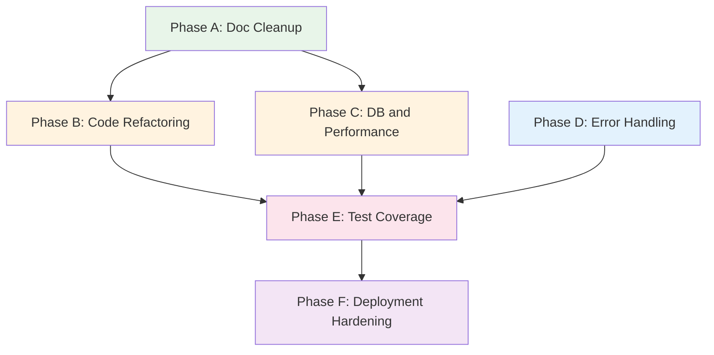

# Codebase Analysis: pytaaa_web

**Date:** 2026-02-06  
**Scope:** Full codebase review — organization, readability, maintainability, and Raspberry Pi deployment readiness

---

## 1. Executive Summary

This is a well-scoped personal project: a FastAPI dashboard for 6 stock trading models with PostgreSQL persistence, Chart.js visualization, and a planned Raspberry Pi deployment. The codebase is **functional and reasonably organized** for its current size (~1,500 LOC of Python + ~3 HTML pages). However, it has accumulated structural debt from rapid iterative development, and several areas will become pain points as the project moves toward production deployment.

**Overall Grade: B-** — Solid foundation, but needs cleanup before Phase 6/7.

---

## 2. What's Working Well ✅

### 2.1 Clean Domain Model
The SQLAlchemy models in [`app/models/trading.py`](app/models/trading.py) are well-designed:
- Clear entity separation: `TradingModel`, `PortfolioSnapshot`, `PortfolioHolding`, `PerformanceMetric`, `BacktestData`
- Proper use of `Mapped[]` type annotations with SQLAlchemy 2.0 style
- Good use of relationships with `cascade="all, delete-orphan"`
- The `DateType` alias to avoid shadowing `date` was a smart fix

### 2.2 Parser Architecture
The four parsers in [`app/parsers/`](app/parsers/) follow a consistent pattern:
- Each has a custom exception class (e.g., `StatusParseError`)
- Each validates file existence upfront
- Each handles IOError and generic exceptions
- The backtest parser smartly handles both 5-column and 6-column formats

### 2.3 DRY Helper
The [`get_model_or_404()`](app/api/v1/endpoints/models.py:27) helper eliminates duplicate model validation — good refactoring.

### 2.4 Test Infrastructure
The [`tests/conftest.py`](tests/conftest.py) fixture setup is solid:
- Per-function database isolation with `drop_all`/`create_all`
- `NullPool` to prevent connection leaks
- Clean dependency override pattern for FastAPI

### 2.5 Deployment Documentation
[`docs/RASPBERRY_PI_DEPLOYMENT.md`](docs/RASPBERRY_PI_DEPLOYMENT.md) is thorough — 10 steps with commands, troubleshooting, cost analysis, and performance benchmarks. The [`docs/nginx.conf`](docs/nginx.conf) and [`docs/fail2ban-pytaaa.conf`](docs/fail2ban-pytaaa.conf) are production-ready configs.

---

## 3. Critical Issues 🔴

### 3.1 The ROADMAP.md is a 886-line Graveyard

[`ROADMAP.md`](ROADMAP.md) has become a dumping ground for completed work, abandoned plans, duplicate task lists, and AI model cost comparisons. It contains:

- **Completed phases 1–5D** with full implementation details that belong in [`LOG.md`](LOG.md)
- **Duplicate task lists** — tasks 5.1–5.5 appear twice with slightly different wording (lines 385–426 vs 559–576)
- **AI model selection advice** (lines 714–778) — "Use Sonnet for this, Haiku for that" — irrelevant to the project itself
- **Abandoned Option A/B discussions** (lines 632–712) for model selection that was already resolved in Phase 5D
- **Stale unchecked items** (lines 503–616) for work that was completed phases ago

**Impact:** A new contributor (or future-you) opening this file would be overwhelmed and confused about what's actually left to do vs. what's historical noise.

### 3.2 The God Endpoint File

[`app/api/v1/endpoints/models.py`](app/api/v1/endpoints/models.py) is 477 lines containing **10 endpoints** that handle:
- Model listing with custom sorting logic
- Performance queries
- Holdings queries with sub-model resolution
- Snapshot date listing
- Historical holdings by date
- Backtest data retrieval
- Backtest comparison

This violates the Single Responsibility Principle. The file mixes concerns: model CRUD, performance analytics, portfolio management, and backtest visualization.

### 3.3 Duplicate Database Setup in CLI

[`app/cli/ingest.py`](app/cli/ingest.py) creates its own database engine on lines 40–43 and again on lines 249–252:

```python
settings = Settings(POSTGRES_SERVER="localhost")
database_url = settings.get_database_url()
engine = create_async_engine(database_url)
async_session = async_sessionmaker(engine, expire_on_commit=False)
```

This pattern is duplicated in both [`ingest_model()`](app/cli/ingest.py:23) and [`ingest_backtest_data()`](app/cli/ingest.py:238). It also hardcodes `POSTGRES_SERVER="localhost"` which will break when running inside Docker.

### 3.4 No Compound Indexes Where Needed

[`PerformanceMetric`](app/models/trading.py:56) has separate indexes on `model_id` (implicit via FK) and `date`, but the most common query pattern is `WHERE model_id = X AND date >= Y ORDER BY date`. A compound index on `(model_id, date)` would be significantly more efficient. `BacktestData` has this compound index, but `PerformanceMetric` and `PortfolioSnapshot` do not.

### 3.5 Missing BacktestData Import in migrations/env.py

[`migrations/env.py`](migrations/env.py:8) imports `TradingModel, PortfolioSnapshot, PortfolioHolding, PerformanceMetric` but **not** `BacktestData`. This means future autogenerated migrations may not detect changes to the `BacktestData` model. It worked previously because the migration was manually created, but this is a ticking time bomb.

### 3.6 nginx.conf Has a Syntax Error

[`docs/nginx.conf`](docs/nginx.conf:56) places `limit_req_zone` inside a `server` block:
```nginx
limit_req_zone $binary_remote_addr zone=api_limit:10m rate=10r/s;
```
This directive must be in the `http` context, not inside `server`. nginx will fail to start with this config.

---

## 4. Moderate Issues 🟡

### 4.1 LOG.md is 649 Lines of Unstructured History

[`LOG.md`](LOG.md) duplicates much of what's in [`ROADMAP.md`](ROADMAP.md). Both files contain implementation details for every phase. There's no clear separation of "what we planned" vs "what we did" vs "what we learned."

### 4.2 No Service Layer

All business logic lives directly in endpoint functions. For example, the custom sort logic in [`list_models()`](app/api/v1/endpoints/models.py:69) (swapping naz100_pi and naz100_pine for visual alignment) is presentation logic embedded in the API layer. The holdings endpoint at line 222 has 55 lines of database queries and data transformation mixed together.

### 4.3 Inconsistent Error Handling in Parsers

- [`status_parser.py`](app/parsers/status_parser.py:56) raises `StatusParseError` on invalid data values but silently skips non-matching lines
- [`backtest_parser.py`](app/parsers/backtest_parser.py:50) raises on wrong column count (strict)
- [`holdings_parser.py`](app/parsers/holdings_parser.py:80) silently `continue`s on unparseable dates with a bare `except:`

The bare `except:` on line 80 of holdings_parser.py is particularly dangerous — it swallows all exceptions including `KeyboardInterrupt`.

### 4.4 start_pytaaa_web_db.sh is Not a Real Script

[`start_pytaaa_web_db.sh`](start_pytaaa_web_db.sh) has no shebang line, no error handling, and contains bare URLs (lines 28–34) that would cause shell errors if actually executed. It's more of a notes file than a script.

### 4.5 Test Coverage Gaps

- **No tests for backtest endpoints** — the 3 backtest-related endpoints in [`models.py`](app/api/v1/endpoints/models.py:363) have zero test coverage
- **No tests for backtest parser** — [`backtest_parser.py`](app/parsers/backtest_parser.py) is untested
- **No tests for CLI ingest** — the entire [`app/cli/ingest.py`](app/cli/ingest.py) module is untested
- [`conftest.py`](tests/conftest.py:14) doesn't import `BacktestData`, so test DB won't have that table

### 4.6 Hardcoded Data Paths

[`README.md`](README.md:41) and [`start_pytaaa_web_db.sh`](start_pytaaa_web_db.sh:5) contain hardcoded paths like `/Users/donaldpg/pyTAAA_data/`. These should be environment variables or config values.

### 4.7 Static HTML Files Are Monoliths

The three HTML files (`dashboard.html`, `comparison.html`, `backtest.html`) each contain inline CSS and JavaScript. There's no shared stylesheet or JavaScript module. Color constants, API base URLs, and chart configurations are duplicated across all three files.

### 4.8 `echo=True` in Production Database Engine

[`app/db/session.py`](app/db/session.py:4) has `echo=True` which logs every SQL query. This is fine for development but will flood logs in production and degrade performance.

---

## 5. Minor Issues 🟢

### 5.1 Unused `pandas` Dependency
[`requirements.txt`](requirements.txt:11) includes `pandas==2.2.1` but it's never imported anywhere in the codebase. This adds ~150MB to the Docker image unnecessarily.

### 5.2 `app/utils/__init__.py` is a Vestige
[`app/utils/__init__.py`](app/utils/__init__.py) exists but the only file that was in `app/utils/` (`model_selection.py`) was deleted in Phase 5D. The package is now empty.

### 5.3 Docstring on Compare Endpoint is Wrong
[`compare_models()`](app/api/v1/endpoints/models.py:109) docstring says "max 5000" but the actual validation allows up to 100,000.

### 5.4 `compare_backtest_data` Route Ordering Issue
[`/backtest/compare`](app/api/v1/endpoints/models.py:422) is defined after `/{model_id}/backtest` (line 363). FastAPI will try to match "backtest" as a UUID for `model_id` first, which will fail with a 422 validation error rather than routing to the compare endpoint.

### 5.5 Docker Compose Uses `--reload` in Production
[`Dockerfile`](Dockerfile:25) CMD uses `--reload` which watches for file changes — inappropriate for production and wastes CPU.

---

## 6. Raspberry Pi Deployment Readiness Assessment

### Documentation Quality: A-
The [`docs/RASPBERRY_PI_DEPLOYMENT.md`](docs/RASPBERRY_PI_DEPLOYMENT.md) is comprehensive with:
- ✅ Step-by-step commands for all 10 setup stages
- ✅ Troubleshooting section covering common issues
- ✅ Performance benchmarks on actual Pi 4 hardware
- ✅ Cost analysis showing $0/month operation
- ✅ Maintenance schedule (daily/weekly/monthly)

### Gaps to Address Before Deployment:
1. **nginx.conf syntax error** — `limit_req_zone` must move to `http` context
2. **No health check endpoint** — Docker and monitoring tools need a `/health` route
3. **No `--all-models` CLI flag** — Referenced in deployment docs but not implemented in [`ingest.py`](app/cli/ingest.py)
4. **No `.env.example`** — Deployment guide references `.env` but no template exists
5. **Docker Compose lacks restart policy** — Containers won't auto-restart after Pi reboot
6. **No ARM64 testing** — Dockerfile uses `python:3.12-slim` which supports ARM64, but `psycopg2-binary` may have issues on ARM
7. **`echo=True`** will flood Pi's limited storage with SQL logs

---

## 7. Improvement Suggestions & Implementation Plan

### Phase A: Documentation Cleanup

| # | Task | Files |
|---|------|-------|
| A1 | Trim ROADMAP.md to only future work — move completed phase details to LOG.md or delete them | `ROADMAP.md` |
| A2 | Remove duplicate task lists, AI model recommendations, and abandoned Option A/B discussions from ROADMAP.md | `ROADMAP.md` |
| A3 | Create a clean "What's Done / What's Next" section at the top of ROADMAP.md | `ROADMAP.md` |
| A4 | Trim LOG.md to key decisions and lessons learned, not blow-by-blow implementation details | `LOG.md` |
| A5 | Fix start_pytaaa_web_db.sh — add shebang, error handling, remove bare URLs | `start_pytaaa_web_db.sh` |
| A6 | Create `.env.example` with all required environment variables documented | `.env.example` |
| A7 | Fix docstring on compare_models endpoint | `app/api/v1/endpoints/models.py` |

### Phase B: Code Structure Refactoring

| # | Task | Files |
|---|------|-------|
| B1 | Split models.py endpoints into separate files: `performance.py`, `holdings.py`, `backtest.py`, keeping `models.py` for model CRUD only | `app/api/v1/endpoints/` |
| B2 | Create a service layer: `app/services/models.py` for business logic like custom sorting, sub-model resolution | `app/services/` |
| B3 | Extract shared database setup from CLI into a reusable factory function | `app/db/session.py`, `app/cli/ingest.py` |
| B4 | Fix route ordering — move `/backtest/compare` before `/{model_id}/backtest` | `app/api/v1/endpoints/` or `app/api/v1/api.py` |
| B5 | Remove empty `app/utils/` package | `app/utils/` |
| B6 | Extract shared CSS/JS from HTML files into `app/static/shared.css` and `app/static/shared.js` | `app/static/` |

### Phase C: Database & Performance

| # | Task | Files |
|---|------|-------|
| C1 | Add compound index on `(model_id, date)` for PerformanceMetric and PortfolioSnapshot | `app/models/trading.py`, new migration |
| C2 | Add BacktestData import to migrations/env.py | `migrations/env.py` |
| C3 | Make `echo=True` configurable via environment variable, default to False | `app/db/session.py`, `app/core/config.py` |
| C4 | Remove unused `pandas` from requirements.txt | `requirements.txt` |

### Phase D: Error Handling & Robustness

| # | Task | Files |
|---|------|-------|
| D1 | Fix bare `except:` in holdings_parser.py — catch specific exceptions | `app/parsers/holdings_parser.py` |
| D2 | Add `/health` endpoint for Docker and monitoring | `app/main.py` |
| D3 | Implement `--all-models` CLI flag referenced in deployment docs | `app/cli/ingest.py` |
| D4 | Add logging module instead of print statements in CLI | `app/cli/ingest.py` |

### Phase E: Test Coverage

| # | Task | Files |
|---|------|-------|
| E1 | Add BacktestData to conftest.py imports | `tests/conftest.py` |
| E2 | Write tests for backtest endpoints — empty DB, populated, date filtering | `tests/test_api_endpoints.py` |
| E3 | Write tests for backtest_parser — valid 5-col, valid 6-col, malformed, empty | `tests/test_parsers.py` |
| E4 | Write basic CLI ingest tests with mock filesystem | `tests/test_cli_ingest.py` |

### Phase F: Deployment Hardening

| # | Task | Files |
|---|------|-------|
| F1 | Fix nginx.conf — move limit_req_zone to http context | `docs/nginx.conf` |
| F2 | Add restart policy to docker-compose.yml | `docker-compose.yml` |
| F3 | Remove `--reload` from Dockerfile CMD, use env var to control | `Dockerfile` |
| F4 | Add Docker health check for app container | `docker-compose.yml`, `app/main.py` |
| F5 | Create production docker-compose.prod.yml without volume mounts or reload | `docker-compose.prod.yml` |

---

## 8. Recommended Execution Order



**Suggested order:**
1. **Phase A** first — clean docs make everything else easier to reason about
2. **Phase C + D** next — quick wins that improve reliability
3. **Phase B** — the biggest refactor, do it with clean docs and good tests
4. **Phase E** — write tests against the refactored code
5. **Phase F** — final hardening before Pi deployment

---

## 9. Summary of Raspberry Pi Deployment Plans

The deployment strategy documented across [`README.md`](README.md:89), [`spec.md`](spec.md:132), [`ROADMAP.md`](ROADMAP.md:812), and [`docs/RASPBERRY_PI_DEPLOYMENT.md`](docs/RASPBERRY_PI_DEPLOYMENT.md) is:

**Architecture:** FastAPI + PostgreSQL in Docker on Raspberry Pi 4, behind nginx reverse proxy with HTTPS via Let's Encrypt, basic auth, and fail2ban.

**Data flow:** Mac runs PyTAAA.master → generates .params files → rsync to Pi at 5pm daily → CLI ingest updates database → dashboard serves latest data.

**Key components:**
- Docker Compose orchestrates FastAPI + PostgreSQL containers
- nginx handles HTTPS termination, basic auth, rate limiting, and security headers
- DuckDNS provides free dynamic DNS for home IP
- fail2ban blocks brute force attempts after 3 failures
- Let's Encrypt auto-renews SSL certificates

**Performance validated:** Dashboard loads in 320ms, 90-day queries in 145ms, supports 10+ concurrent users on Pi 4 with 4GB RAM.

**Gaps before deployment:** nginx config syntax error, missing health check, missing `--all-models` flag, no restart policy, `echo=True` will flood logs, no `.env.example` template.
